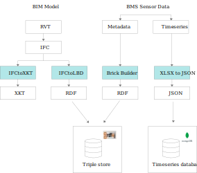
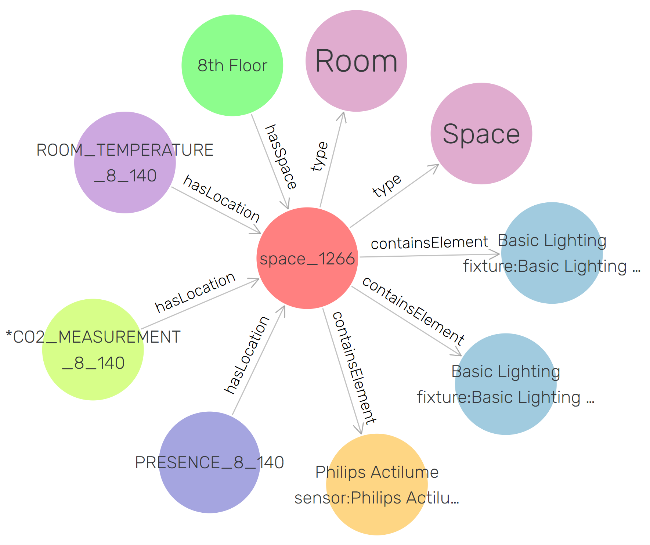

# Atlas building graph

-  This is an RDF graph based on LBD Brick SSN ontologies for TUE Atlas Building 8-9 floors.
-  IFCto LBD converer (https://github.com/pipauwel/IFCtoLBD) is used to generate the semantic graph of the building.
-  BrickBuilder tool (https://github.com/gtfierro/brick-builder) is used to generate BAS semantics using BAS point names.

-  A practical application of this graph is demonstrated in the article "A web-based approach to BMS, BIM and IoT integration" available in https://proceedings.open.tudelft.nl/clima2022/article/view/228.

 <figure>
    

        
    

  <figcaption>Data sources and conversion (source : https://proceedings.open.tudelft.nl/clima2022/article/view/228)<figcaption>
</figure>

<figure>
    

        
  

  <figcaption>A sample of the graph visualization (source : https://proceedings.open.tudelft.nl/clima2022/article/view/228)<figcaption>
</figure>